# Tech Challenge — Fase 3
## Modelo preditivo e inteligência analítica para o Indicador Criança Alfabetizada

Pós-Graduação em Inteligência Artificial e Ciência de Dados — FIAP

**Integrantes:** _(preencher com nome e RM de cada integrante)_

**Vídeo executivo (≤ 5 min):** _(inserir link após a gravação)_

**Fase 2 — entrega do grupo:** https://github.com/leonardoaz98/aws-tech-challenge2-fiap

**Fase 2 — pipeline que gerou a Gold usada aqui:** https://github.com/fernanda161082/tech-challenge-fase2

---

## 1. Contexto do problema

O Compromisso Nacional Criança Alfabetizada estabeleceu a meta de que toda criança brasileira esteja alfabetizada ao final do 2º ano do Ensino Fundamental. O acompanhamento é feito pelo **Indicador Criança Alfabetizada**, calculado pelo INEP a partir de uma avaliação aplicada em rede nacional: para cada município e cada rede de ensino, o indicador expressa o percentual de estudantes que atingiram o nível esperado de leitura e escrita.

Cada município recebe uma **meta anual individualizada**, construída a partir do seu próprio ponto de partida — municípios com desempenho mais baixo recebem metas de crescimento mais exigentes — até a meta nacional de 80% em 2030.

O problema de gestão pública é de **antecipação**. Hoje o acompanhamento é retrospectivo: o gestor descobre que um município não atingiu a meta quando o resultado do ano é publicado, isto é, quando a coorte de crianças já passou pelo 2º ano. Se fosse possível identificar, **antes** do ciclo terminar, quais municípios têm maior probabilidade de não alcançar a meta, a política pública poderia agir durante o ano letivo em vez de constatar o fracasso depois.

Esta fase do Tech Challenge constrói esse instrumento de antecipação e, tão importante quanto, investiga **quais fatores estão associados** ao cumprimento da meta — porque um alerta sem explicação não orienta decisão nenhuma.

---

## 2. Objetivo analítico

### 2.1 Pergunta de negócio

> Quais municípios têm maior risco de não atingir a meta de alfabetização do ano seguinte, e quais características explicam esse risco?

### 2.2 Formulação técnica

Trata-se de um problema de **classificação binária supervisionada**:

| Elemento | Definição |
|---|---|
| **Unidade de análise** | Município × rede municipal de ensino |
| **Variável-alvo** | `atingiu_meta` — 1 se o indicador de 2024 ≥ meta de 2024, 0 caso contrário |
| **Variáveis preditoras** | Desempenho de 2023, meta de 2024, esforço exigido, participação na avaliação, UF, porte, território e PIB por habitante |
| **Separação temporal** | Features de **2023** → alvo de **2024** |

### 2.3 Por que o município e não o aluno

O enunciado da fase menciona prever "se um aluno será alfabetizado". Essa formulação não é implementável com os dados públicos disponíveis, e a razão é importante:

- **Não existe microdado individual de alfabetização aberto ao público.** Os resultados do Indicador Criança Alfabetizada são divulgados de forma agregada. Dados individuais de crianças de 7 anos são protegidos pela LGPD (Lei 13.709/2018), com proteção reforçada por se tratar de dados de crianças (art. 14).
- **A menor granularidade disponível é município × ano × série × rede.** Qualquer modelo "por aluno" construído sobre dados agregados seria uma ficção estatística: repetiria o valor do município para cada criança, inflando artificialmente o número de observações e produzindo métricas otimistas e falsas.

A reinterpretação mantém o **espírito** da pergunta — antecipar risco de não alfabetização — no nível em que o dado existe e no nível em que a decisão pública é tomada. Política de alfabetização é desenhada e orçada por rede de ensino, não criança a criança. **O município é a unidade de decisão, não apenas a unidade de dado disponível.**

### 2.4 Rede municipal

O recorte é a **rede municipal** (código 3 na base). Justificativa: é a rede responsável pela quase totalidade da oferta de anos iniciais do Ensino Fundamental no Brasil e é sobre ela que o gestor municipal tem governança direta. Incluir redes estadual e privada misturaria unidades com estruturas de financiamento e gestão incomparáveis.

---

## 3. Descrição da base de dados

### 3.1 Origem

A base parte da **camada Gold do pipeline construído na Fase 2** (arquitetura Medallion sobre AWS), que já entrega os dados do INEP tratados, tipados e validados. Reaproveitar a Gold é o comportamento correto: a Fase 2 existe justamente para que a Fase 3 não precise repetir ingestão e limpeza.

| Fonte | Origem | Conteúdo |
|---|---|---|
| Indicador Criança Alfabetizada | INEP, via Gold da Fase 2 | Percentual de alfabetizados por município, ano, série e rede |
| Metas de alfabetização | INEP, via Gold da Fase 2 | Meta individualizada por município e ano |
| Localidades | API IBGE `/localidades/municipios` | Nome, microrregião, mesorregião, região imediata e intermediária, UF |
| População | API SIDRA, agregado 6579 (2021) | População residente estimada por município |
| PIB municipal | API SIDRA, agregado 5938 (2021) | Produto Interno Bruto municipal, base do PIB por habitante |

**Conferência da origem.** As variáveis consumidas da Gold foram validadas contra os microdados originais do INEP por reconstrução independente: a base analítica foi remontada a partir dos CSVs de origem, aplicando as regras diretamente na fonte, e chegou aos mesmos **5.232 municípios** e à mesma distribuição do alvo (**53,3% / 46,7%**).

Verificou-se também a estabilidade das metas entre publicações, ponto sensível porque é dela que sai a variável-alvo: a meta de 2024 divulgada na publicação de 2023 é **idêntica** à da publicação de 2024 nos 5.352 municípios presentes nas duas, e a tabela de metas municipais possui uma única rede. A escolha entre revisões, portanto, não altera o alvo.

O caminho da Gold é configurável no topo de `construir_base_analitica.py`; por padrão, o script a procura em `../TechChallengeFase2`.

### 3.2 Construção da base analítica

`src/preprocessing/construir_base_analitica.py` transforma a Gold em **uma linha por município**, com as variáveis de 2023 como preditoras e o resultado de 2024 como alvo.

Duas variáveis são derivadas nesta etapa:

```python
base["esforco_exigido"] = base["meta_2024"] - base["taxa_2023"]
base["atingiu_meta"]    = (base["_auditoria_taxa_2024"] >= base["meta_2024"]).astype(int)
```

O `esforco_exigido` traduz a meta em quanto o município precisa **crescer** — informação que nem a taxa nem a meta isoladamente carregam. A coluna `_auditoria_taxa_2024` é mantida com prefixo `_` para conferência manual, mas **nunca entra no modelo**: ela é o próprio resultado que se quer prever.

### 3.3 Enriquecimento externo

`src/preprocessing/enriquecer_base.py` junta os dados do IBGE e cria duas variáveis:

- **`log_populacao`** — `np.log1p(populacao)`. A população municipal brasileira é fortemente assimétrica: milhares de municípios com poucos milhares de habitantes e um punhado de metrópoles de milhões. O logaritmo aproxima a distribuição de uma normal, o que ajuda modelos lineares.
- **`porte_municipio`** — faixas usadas em política pública brasileira (pequeno I < 20 mil, pequeno II < 50 mil, médio < 100 mil, grande < 900 mil, metrópole ≥ 900 mil). Os cortes acompanham a mudança de **natureza** da gestão: administrar 5 mil habitantes é um problema diferente de administrar 500 mil.
- **`log_pib_per_capita`** — variável socioeconômica. O IBGE publica o PIB municipal em mil reais; o script converte para reais, divide pela população e aplica o logaritmo, pela mesma assimetria da população (municípios com refinaria, mineração ou porto distorcem a escala). O ano de referência é 2021, o mais recente da série.

A variável do PIB não é fixada por um código numérico no script: `baixar_dados_ibge.py` consulta antes os metadados do agregado 5938 e escolhe a variável pelo nome, preferindo o PIB per capita quando publicado e caindo para o PIB total em caso contrário. A unidade de medida vem junto e é conferida, porque um erro de fator 1.000 não geraria erro nenhum — só um modelo treinado com números errados.

O script mede a cobertura do join e faz uma **conferência cruzada**: a UF derivada do prefixo do código IBGE na Fase 2 é comparada com a UF que o próprio IBGE informa. Zero divergências — validação por fonte independente, que é mais forte do que qualquer verificação interna.

### 3.4 Base final

| Característica | Valor |
|---|---|
| Municípios | **5.232** |
| Cobertura do enriquecimento IBGE | **100%** |
| Variáveis candidatas ao modelo | 15 (11 após os descartes da EDA) |
| Valores nulos nas variáveis do modelo | **0** |
| Distribuição do alvo | 53,3% atingiram a meta / 46,7% não atingiram |
| UFs representadas | 24 |

Três ausências, por dois motivos diferentes:

- **Distrito Federal**: Brasília não é município. O DF acumula funções de estado e município e não possui rede municipal de ensino. A ausência é **estrutural**, não uma falha do dado.
- **Acre e Roraima**: nenhum município desses estados aparece com rede municipal nesta avaliação. É uma característica real da base, e está registrada na seção de limitações.

Dos 5.396 municípios com dado de 2023, **164 foram descartados** por não possuírem meta definida para 2024 — sem meta não existe alvo a prever.

---

## 4. Etapas de modelagem

```
Gold da Fase 2
      │
      ├─ construir_base_analitica.py ──► base_analitica.parquet      (5.232 × 12)
      │
      ├─ baixar_dados_ibge.py ────────► data/raw/*.csv               (aquisição)
      │
      ├─ enriquecer_base.py ──────────► base_enriquecida.parquet     (5.232 × 22)
      │
      ├─ analise_exploratoria.py ─────► reports/eda_resumo.json
      │                                  images/eda_distribuicoes.png
      │                                  images/eda_correlacoes.png
      │                                  images/eda_atingimento_por_uf.png
      │                                  images/eda_riqueza_vs_desempenho.png
      │                                  images/eda_teto_previsibilidade.png
      │                                  images/eda_hipotese_participacao.png
      │
      ├─ treinar_modelo.py ───────────► models/modelo.joblib
      │                                  reports/resultado_modelo.json
      │
      ├─ interpretar_modelo.py ───────► reports/interpretabilidade.json
      │                                  images/coeficientes.png
      │                                  images/importancia_permutacao.png
      │                                  images/estabilidade_ranking.png
      │
      └─ aplicacao_estrategica.py ────► reports/ranking_risco_municipios.csv
                                         reports/perfis_municipais.csv
                                         reports/risco_por_uf.csv
                                         images/risco_por_uf.png
                                         images/perfis_municipais.png
```

### 4.1 Análise exploratória

A exploração vem antes da modelagem e é o que determina as decisões seguintes. Está em `src/visualization/analise_exploratoria.py` (cálculos e gráficos) e em `notebooks/01_analise_exploratoria.ipynb` (a leitura comentada, seção por seção). Os números completos ficam em `reports/eda_resumo.json`.

**Distribuições por classe**

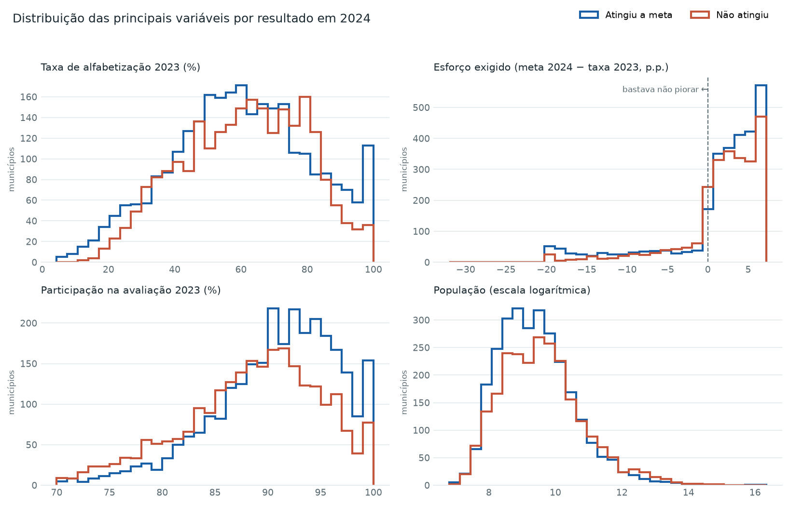

As curvas de desempenho de 2023 quase se sobrepõem entre quem atingiu e quem não atingiu a meta. Isso é consequência direta do desenho da política: a meta de cada município é calculada a partir do seu próprio ponto de partida, então **ir bem em 2023 não facilita atingir a meta de 2024**. A participação é a única numérica visivelmente deslocada.

**Correlações**

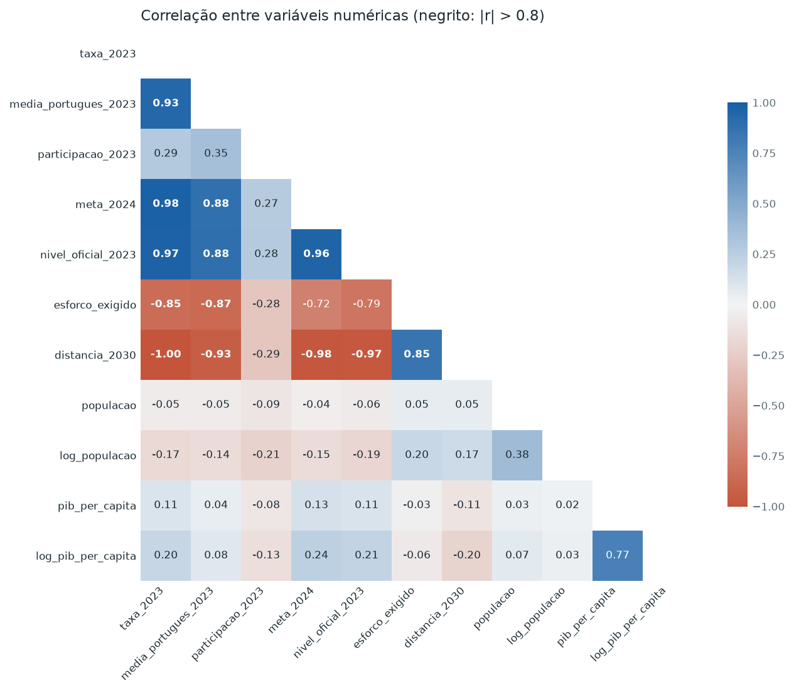

**Atingimento por território**

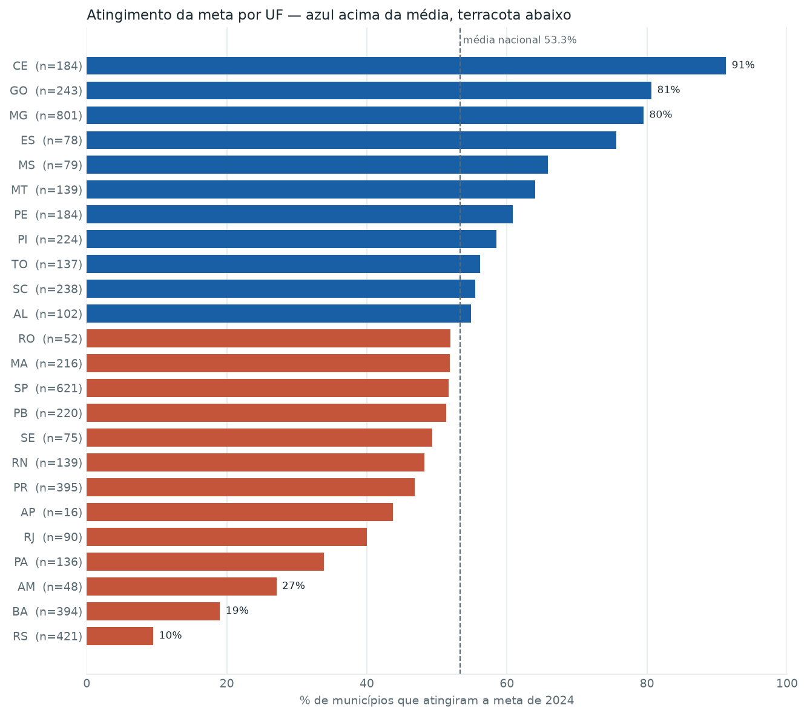

Ceará 91,3% contra Rio Grande do Sul 9,5%: **82 pontos percentuais** de amplitude entre estados, contra 12 pontos entre faixas de porte populacional.

**Riqueza do estado e desempenho educacional**

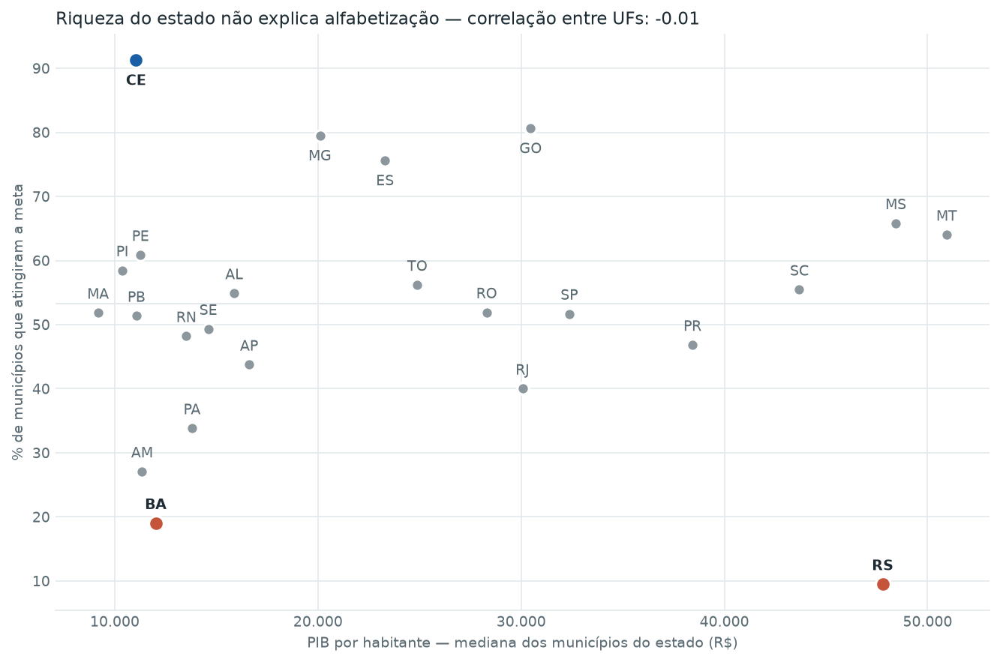

| Medida | Valor |
|---|---|
| Correlação entre UFs (PIB mediano × % que atingiu) | **−0,011** |
| Correlação média dentro de cada UF | −0,008 |
| PIB por habitante mediano — maior | Mato Grosso, R$ 50.940 |
| PIB por habitante mediano — menor | Maranhão, R$ 9.177 |

A riqueza varia cinco vezes e meia entre os estados e **não explica nada** do desempenho em alfabetização — nem entre estados, nem entre municípios do mesmo estado. A seção 9.1 desenvolve o que isso significa.

**Poder de separação de cada variável isolada**

Medindo a AUC de cada variável usada sozinha (0,5 = não separa nada):

| Variável | AUC univariada |
|---|---|
| `sigla_uf` | **0,729** |
| `regiao` | 0,640 |
| `participacao_2023` | 0,608 |
| `log_populacao` | 0,543 |
| `log_pib_per_capita` | 0,522 |
| `taxa_2023` | 0,515 |
| `esforco_exigido` | 0,511 |

O modelo completo chega a 0,780 e a **UF sozinha já chega a 0,729**. É a medida mais direta da ancoragem estadual discutida na seção 9.1 — e ela apareceu na exploração, antes de qualquer treino. Para as categóricas, cada categoria foi substituída pela taxa de atingimento do grupo, calculada por validação cruzada, de modo que o valor de cada município é estimado sem ele próprio.

**Hipóteses testadas**

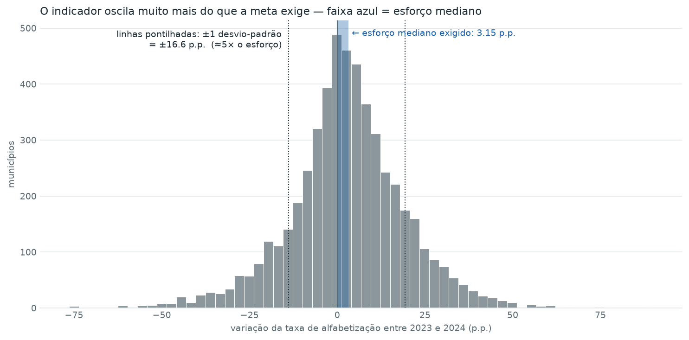

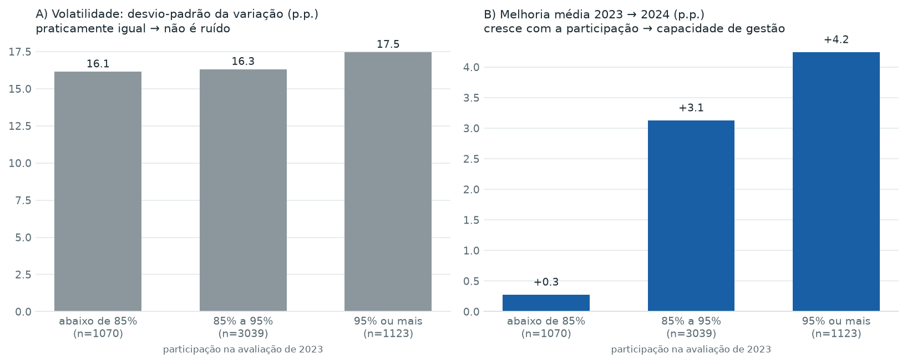

As duas hipóteses e seus resultados estão detalhados nas seções 8.1 e 9.2.

**Síntese: o que a exploração decidiu**

| Achado | Decisão |
|---|---|
| Classes equilibradas (53,3%) | Sem rebalanceamento; AUC como métrica principal |
| `meta_2030` constante | Removida |
| `distancia_2030` = `80 − taxa_2023` | Removida |
| 13 pares com \|r\| > 0,80 | Teste de estabilidade da importância em 8 sementes |
| População com assimetria +38 | Transformação logarítmica |
| UF sozinha: AUC 0,729 | Limitação 9.1 documentada desde o início |
| Ruído ≈ 5× o sinal | Expectativa realista de desempenho (seção 9.2) |
| Participação = gestão, não ruído | Variável mantida; base dos perfis municipais |

### 4.2 Prevenção de vazamento de dados (*data leakage*)

Vazamento é o erro mais comum e mais destrutivo em modelagem preditiva: o modelo recebe, direta ou indiretamente, informação que na prática só existiria **depois** do momento da previsão. O resultado é um modelo com métricas excelentes na validação e inútil em produção.

Três barreiras foram implantadas:

**a) Separação temporal explícita.** Todas as preditoras são de 2023; o alvo é de 2024. O modelo simula a posição real do gestor no início de 2024: ele conhece o resultado do ano anterior e a meta, e não conhece o futuro.

**b) Exclusão do resultado do ano-alvo.** A taxa de 2024 permanece na base apenas como `_auditoria_taxa_2024` e é removida antes do treino. Um modelo que a recebesse alcançaria acurácia próxima de 100% — e não estaria prevendo nada, apenas comparando dois números.

**c) Pré-processamento dentro do Pipeline.** Imputação e padronização são etapas do `Pipeline` do scikit-learn, não operações aplicadas à base inteira antes do split:

```python
Pipeline([
    ("preprocessamento", ColumnTransformer([
        ("num", Pipeline([("imputer", SimpleImputer(strategy="median")),
                          ("scaler",  StandardScaler())]), colunas_numericas),
        ("cat", Pipeline([("imputer", SimpleImputer(strategy="most_frequent")),
                          ("onehot",  OneHotEncoder(handle_unknown="ignore",
                                                    sparse_output=False))]), colunas_categoricas),
    ])),
    ("modelo", modelo),
])
```

Se a mediana usada na imputação fosse calculada sobre a base completa, ela carregaria informação do conjunto de teste para dentro do treino — um vazamento sutil, que não aparece em nenhuma mensagem de erro, e que infla a métrica de validação. Dentro do `Pipeline`, cada *fold* da validação cruzada aprende seus próprios parâmetros de transformação.

### 4.3 Variáveis descartadas na análise exploratória

```python
DESCARTADAS = ["meta_2030", "distancia_2030", "populacao", "pib_per_capita"]
```

| Variável | Motivo |
|---|---|
| `meta_2030` | **Constante**: todos os 5.232 municípios têm valor 80. Variância zero não carrega informação. |
| `distancia_2030` | Correlação **−1,000** com `taxa_2023`. É literalmente `80 − taxa_2023`, a mesma informação com outro nome. |
| `populacao` | Redundante com `log_populacao`, que é a forma mais adequada para modelos lineares. |
| `pib_per_capita` | Mesma razão: entra no modelo como `log_pib_per_capita`. |

Registro honesto: `distancia_2030` foi criada por nós acreditando que capturasse "desafio de longo prazo". A análise exploratória mostrou que era uma transformação determinística de uma variável já presente. **É exatamente para isso que a EDA existe** — descobrir isso antes de treinar, e não depois de interpretar coeficientes de uma variável fantasma.

A matriz de correlação revelou ainda **13 pares de variáveis com |r| > 0,80**. Multicolinearidade não impede o modelo de prever bem, mas distribui a importância entre variáveis correlacionadas de forma instável, o que compromete a interpretação — motivo pelo qual a análise de importância foi acompanhada de um teste de estabilidade (seção 7.3).

### 4.4 Divisão dos dados

- **Treino:** 75% (3.924 municípios)
- **Teste:** 25% (1.308 municípios)
- **Estratificação** pelo alvo, preservando a proporção 53,3% / 46,7% nos dois conjuntos
- **Validação cruzada:** `StratifiedKFold` com 5 *folds* sobre o conjunto de treino

O conjunto de teste é usado **uma única vez**, ao final. Toda a comparação entre modelos acontece na validação cruzada — caso contrário o teste deixaria de ser uma estimativa honesta de desempenho em dados novos.

---

## 5. Escolha do algoritmo

### 5.1 Modelos comparados

| Modelo | AUC (validação cruzada, após otimização) | Papel |
|---|---|---|
| Baseline (`DummyClassifier`) | 0,500 | Piso de comparação |
| **Regressão Logística** | **0,790** | **Modelo escolhido** |
| Random Forest | 0,785 | Ensemble de árvores |
| Gradient Boosting | 0,780 | Ensemble sequencial |

Os valores são os da melhor configuração de cada modelo; a busca que os produziu está na seção 5.4.

### 5.2 Por que começar por um baseline

O `DummyClassifier` prevê sempre a classe majoritária. Ele não é um competidor sério — é uma **régua**. Sem ele, um modelo com 70% de acurácia parece bom; com ele, sabe-se que 53,3% seriam obtidos chutando sempre "atingiu". Qualquer modelo que não supere o baseline com folga não está aprendendo nada dos dados.

### 5.3 Por que a regressão logística venceu

O resultado é contraintuitivo para quem espera que modelos mais complexos sempre vençam, e tem três explicações:

**A relação é predominantemente linear.** As variáveis que mais importam (esforço exigido, taxa anterior, meta) se relacionam com o alvo de forma monotônica: quanto maior o esforço exigido, menor a chance de atingir a meta. Não há interações complexas para os ensembles capturarem.

**O volume de dados favorece modelos simples.** 3.924 observações de treino com 13 variáveis é um regime em que árvores profundas tendem a memorizar ruído. A regressão logística, com menos parâmetros livres, generaliza melhor.

**O ruído é alto.** Como detalhado na seção 9, a variação ano a ano do indicador é cerca de cinco vezes maior que o esforço mediano exigido. Em ambientes ruidosos, flexibilidade extra se converte em ajuste ao acaso.

### 5.4 Otimização de hiperparâmetros

Os valores de hiperparâmetro não foram escolhidos à mão: cada modelo passou por um **`GridSearchCV`**, que testa combinações e fica com a melhor segundo a AUC na validação cruzada.

| Modelo | Hiperparâmetros testados | Combinações | Melhor configuração |
|---|---|---|---|
| Regressão Logística | `C` ∈ {0,01 · 0,1 · 1 · 10 · 100} | 5 | `C = 10` |
| Random Forest | `min_samples_leaf` ∈ {1 · 5 · 15}, `max_depth` ∈ {None · 12} | 6 | `max_depth = None`, `min_samples_leaf = 5` |
| Gradient Boosting | `learning_rate` ∈ {0,03 · 0,06 · 0,12}, `max_leaf_nodes` ∈ {15 · 31}, `l2_regularization` ∈ {0 · 1} | 12 | `learning_rate = 0,03`, `max_leaf_nodes = 15`, `l2 = 1,0` |

Total: **23 combinações × 5 partições = 115 treinos**.

Todos os hiperparâmetros da grade são **freios contra o sobreajuste**: `C` menor significa regularização mais forte; `min_samples_leaf` e `max_depth` impedem que cada árvore se especialize demais; `learning_rate` baixo faz o boosting aprender devagar; `l2_regularization` penaliza folhas extremas. É a resposta direta ao pedido de "estratégias de otimização com o objetivo de aumentar a generalização e reduzir overfitting".

**A busca roda apenas dentro do conjunto de treino.** Escolher hiperparâmetros olhando o conjunto de teste seria vazamento silencioso: o teste deixaria de ser dado novo e passaria a fazer parte da decisão. A seleção usa validação cruzada interna ao treino, e o teste permanece intocado até a avaliação final.

**O que a otimização mostrou**

| Modelo | AUC (melhor) | AUC (pior combinação) | Amplitude |
|---|---|---|---|
| Regressão Logística | 0,790 | 0,758 | 0,032 |
| Random Forest | 0,785 | 0,774 | 0,011 |
| Gradient Boosting | 0,780 | 0,751 | **0,029** |

Três leituras:

1. **A comparação entre modelos ficou justa.** Antes da busca, o Random Forest marcava 0,773 com hiperparâmetros escolhidos manualmente; otimizado, chega a 0,785. A vantagem da regressão logística era em parte artefato de concorrentes mal configurados — e, mesmo com a correção, ela continua à frente.

2. **Configurar bem importa mais do que escolher o modelo.** A diferença entre os três modelos bem configurados é de 0,010; dentro do gradient boosting, entre a melhor e a pior configuração, é de 0,029 — quase três vezes maior.

3. **O ganho final foi marginal, como esperado.** A AUC no teste ficou em 0,780 e a diferença entre validação e teste em 0,009. É coerente com o teto de previsibilidade da seção 9.2: com ruído cerca de cinco vezes maior que o sinal, ajuste fino não produz saltos. Um salto grande aqui seria motivo de desconfiança, não de comemoração.

A busca pode ser desligada com `--sem-busca` para reexecuções rápidas do pipeline.

### 5.5 Vantagem decisiva: interpretabilidade

Mesmo que os ensembles tivessem empatado, a regressão logística seria preferível **neste contexto**. Trata-se de um instrumento de política pública destinado a orientar alocação de recursos que afetam crianças. Um gestor precisa poder responder à pergunta "por que este município foi sinalizado?" — e a resposta "porque um comitê de 300 árvores votou assim" não é aceitável em prestação de contas pública.

Na regressão logística, cada coeficiente é uma frase legível: *"cada ponto percentual adicional de esforço exigido reduz em X a chance de atingir a meta"*. Interpretabilidade aqui não é conveniência técnica — é requisito de **transparência administrativa**.

### 5.6 Alternativas consideradas e descartadas

| Alternativa | Por que não foi usada |
|---|---|
| XGBoost / LightGBM | Dependências externas adicionais sem ganho esperado; o `HistGradientBoostingClassifier` do próprio scikit-learn já cobre a família de boosting |
| Redes neurais | Inadequadas para dados tabulares deste volume; perda total de interpretabilidade |
| SVM | Custo computacional elevado e coeficientes não diretamente interpretáveis com kernel não linear |
| `TargetEncoder` para microrregião | Implementado atrás da flag `--alta-cardinalidade`; 543 categorias gerariam esparsidade excessiva no modo padrão |

---

## 6. Métricas de avaliação

### 6.1 Resultados no conjunto de teste

| Métrica | Valor | Leitura |
|---|---|---|
| **AUC-ROC** | **0,780** | Dados dois municípios ao acaso, um que atingiu e outro que não, o modelo ordena corretamente em 78,0% das vezes |
| Acurácia | 0,703 | 70,3% das classificações corretas (baseline: 53,3%) |
| Precisão | 0,703 | Dos sinalizados como "vai atingir", 70,3% de fato atingiram |
| **Recall** | **0,765** | Dos que realmente atingiram, 76,5% foram identificados |
| F1-Score | 0,733 | Média harmônica entre precisão e recall |

### 6.2 Generalização

| AUC validação cruzada | AUC teste | Diferença |
|---|---|---|
| 0,790 | 0,780 | **0,009** |

Uma diferença de 0,009 entre validação e teste indica **ausência de sobreajuste**. O modelo aprendeu padrões do fenômeno, não particularidades do conjunto de treino. Se o teste tivesse ficado muito abaixo da validação, seria sinal de memorização; muito acima, sinal de uma divisão de dados favorável por acaso — ambos motivos para desconfiar.

### 6.3 Por que AUC é a métrica principal

A acurácia depende do limiar escolhido (0,5 por padrão) e é enganosa em bases desbalanceadas. A AUC avalia a **capacidade de ordenação** do modelo em todos os limiares possíveis, e é isso que importa no uso real: o gestor não tem orçamento para agir em 2.299 municípios simultaneamente. Ele precisa de uma **fila de prioridade**, e a AUC mede exatamente a qualidade dessa fila.

### 6.4 O trade-off precisão × recall neste contexto

O modelo tem recall (0,765) superior à precisão (0,703), e isso é **desejável aqui**.

Os dois erros possíveis têm custos assimétricos:

- **Falso alarme** — sinalizar um município que atingiria a meta de qualquer forma. Custo: apoio técnico e supervisão enviados a quem não precisava tanto. Desperdício moderado de recurso.
- **Falso negativo** — deixar de sinalizar um município que vai falhar. Custo: uma coorte inteira de crianças passa pelo 2º ano sem intervenção.

Em política pública de alfabetização, o segundo erro é incomparavelmente mais grave. O limiar de decisão deve, portanto, ser calibrado para priorizar recall — e o modelo permite esse ajuste, já que produz probabilidades e não apenas rótulos.

---

## 7. Interpretação dos resultados

### 7.1 Importância das variáveis (*permutation importance*)

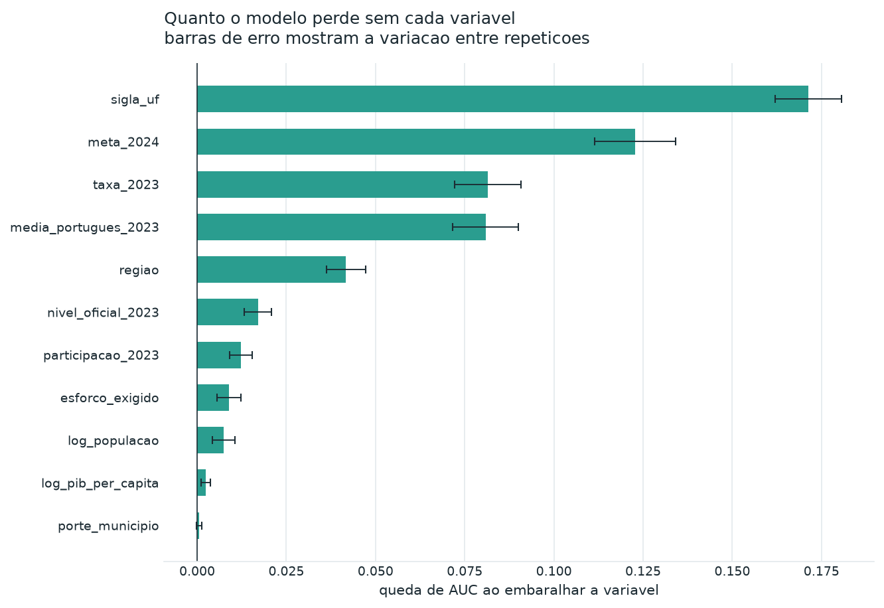

| Posição | Variável | Importância |
|---|---|---|
| 1 | `sigla_uf` | 0,1713 |
| 2 | `esforco_exigido` | — |
| 3 | `meta_2024` | — |
| … | … | … |
| — | `log_pib_per_capita` | 0,0024 |
| — | `log_populacao` | 0,0074 |
| — | `porte_municipio` | 0,0005 |

A *permutation importance* mede o quanto o desempenho do modelo **piora** quando os valores de uma variável são embaralhados. Se embaralhar não muda nada, a variável não estava sendo usada. É uma medida mais honesta que a importância interna dos algoritmos, porque avalia o modelo já treinado no dado de teste.

### 7.2 Coeficientes

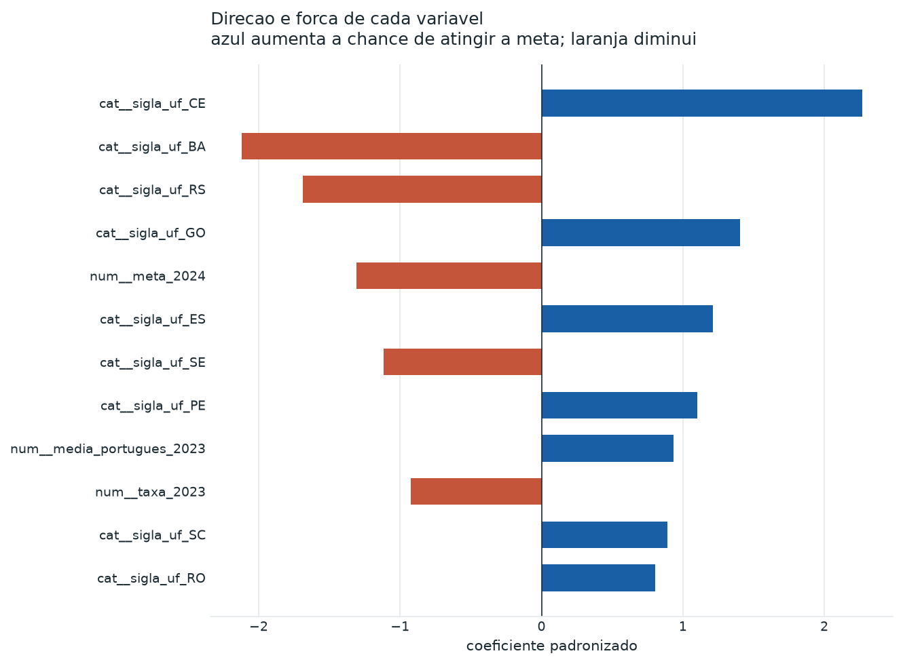

Dois coeficientes merecem destaque:

**`meta_2024`: −1,310.** Quanto maior a meta, menor a chance de atingi-la. Este é o **teste de sanidade** do modelo: se o sinal fosse positivo, haveria erro em algum ponto do pipeline. O modelo aprendeu algo que sabemos ser verdade, o que aumenta a confiança no que ele aprendeu e não sabíamos.

**UF: Ceará +2,267 / Bahia −2,120.** Um município cearense tem probabilidade substancialmente maior de atingir a meta que um baiano com as mesmas características observáveis. O Ceará é, historicamente, referência nacional em alfabetização — o modelo captou de forma independente um fato reconhecido na literatura de política educacional brasileira.

### 7.3 Teste de estabilidade do ranking

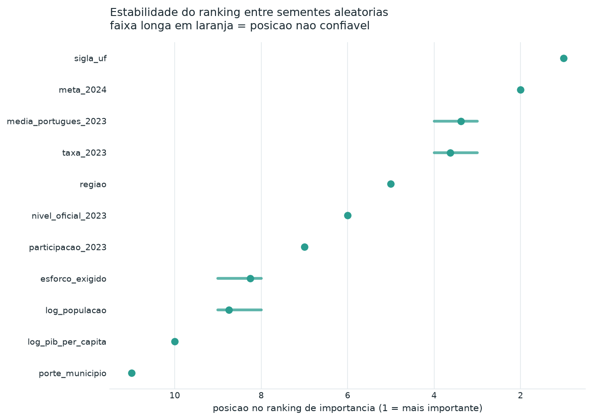

Uma preocupação legítima: com 13 pares de variáveis fortemente correlacionadas, o ranking de importância poderia ser artefato de uma divisão de dados específica. O modelo foi então retreinado com **8 sementes aleatórias diferentes**, registrando a posição de cada variável em cada execução.

`sigla_uf` ocupou a **posição 1 em todas as 8 execuções** (faixa 1–1). O ranking é estável; a liderança da UF não é acidente amostral.

Este teste não é exigido pelo enunciado. Foi acrescentado porque afirmar que uma variável é a mais importante sem verificar se essa afirmação sobrevive a uma troca de semente seria uma conclusão frágil.

### 7.4 SHAP

A análise SHAP (`src/evaluation/interpretar_modelo.py`) decompõe cada previsão individual, mostrando quanto cada variável contribuiu para aquele município específico. A diferença em relação à *permutation importance* é o nível de agregação: a permutação opera sobre a coluna original (`sigla_uf` inteira), o SHAP sobre as colunas pós-one-hot (`sigla_uf_CE`, `sigla_uf_BA`, …). As duas visões são complementares — uma responde "qual variável importa", a outra "por que este município recebeu este score".

### 7.5 População não importa

`log_populacao` (0,0074), `log_pib_per_capita` (0,0024) e `porte_municipio` (0,0005) têm importância praticamente nula **no modelo**.

Isoladamente, ambos mostram alguma associação fraca: `log_populacao` tem AUC univariada de 0,543 e `log_pib_per_capita`, 0,522 — e nos dois casos no sentido **"maior → menos chance"**. Municípios pequenos atingem mais a meta (≈56%) do que os grandes (≈43%), o contrário do que a intuição sugere, e municípios mais ricos atingem ligeiramente menos.

As duas diferenças **desaparecem quando a UF entra no modelo**, o que indica que vinham da composição estadual: os estados com melhor desempenho concentram muitos municípios pequenos e não são os mais ricos.

São **resultados negativos com valor**. A intuição comum é que municípios pequenos ou pobres teriam mais dificuldade — menos estrutura, menos quadro técnico, menos orçamento. O dado não sustenta isso, nem sustenta o inverso como efeito próprio do tamanho ou da renda. Políticas desenhadas sobre a premissa "pequenos e pobres precisam de mais apoio" estariam segmentando pelas variáveis erradas.

---

## 8. Insights encontrados

### 8.1 O achado central: participação é proxy de capacidade de gestão

A comparação dos perfis municipais produziu o resultado mais acionável do trabalho:

| Perfil | Municípios | Taxa 2023 | Participação 2023 | % que atingiu a meta |
|---|---|---|---|---|
| `consolidado` | 579 | alta | alta | **65,5%** |
| `desafio_com_gestao_ativa` | 1.454 | **40,1%** | **91,3%** | **60,2%** |
| `consolidado_2` | 2.205 | média | média | 51,4% |
| `vulneravel` | 994 | **50,4%** | **80,6%** | **40,2%** |

Compare as duas linhas destacadas. O perfil `desafio_com_gestao_ativa` tem desempenho **pior** (40,1% contra 50,4%) e ainda assim atinge a meta com **20 pontos percentuais de vantagem** sobre o perfil `vulneravel`. A única diferença estrutural entre eles é a participação na avaliação: 91,3% contra 80,6%.

**Interpretação.** Uma rede que consegue levar 91% de seus alunos à avaliação demonstra capacidade de organização — cadastro atualizado, comunicação com famílias, logística escolar funcionando, acompanhamento de frequência. Essa mesma capacidade é o que permite executar um plano de alfabetização. A participação não causa alfabetização; ela **revela** a capacidade de gestão que causa.

**Correção de hipótese.** Nossa hipótese inicial era outra: baixa participação produziria um indicador mais ruidoso, porque a amostra seria menor e mais sujeita a variação. O teste refutou isso — a volatilidade é praticamente idêntica entre as faixas de participação (desvio-padrão 16,1 na faixa abaixo de 85% contra 17,5 na faixa de 95% ou mais) e a correlação entre participação e magnitude da variação é de apenas **+0,045**. O que difere é a **direção** da mudança: melhoria média de **+0,3 ponto** na faixa mais baixa contra **+4,2 pontos** na mais alta, com o atingimento subindo de 40,2% para 64,9%. Não é ruído — é desempenho.

### 8.2 Concentração territorial do risco

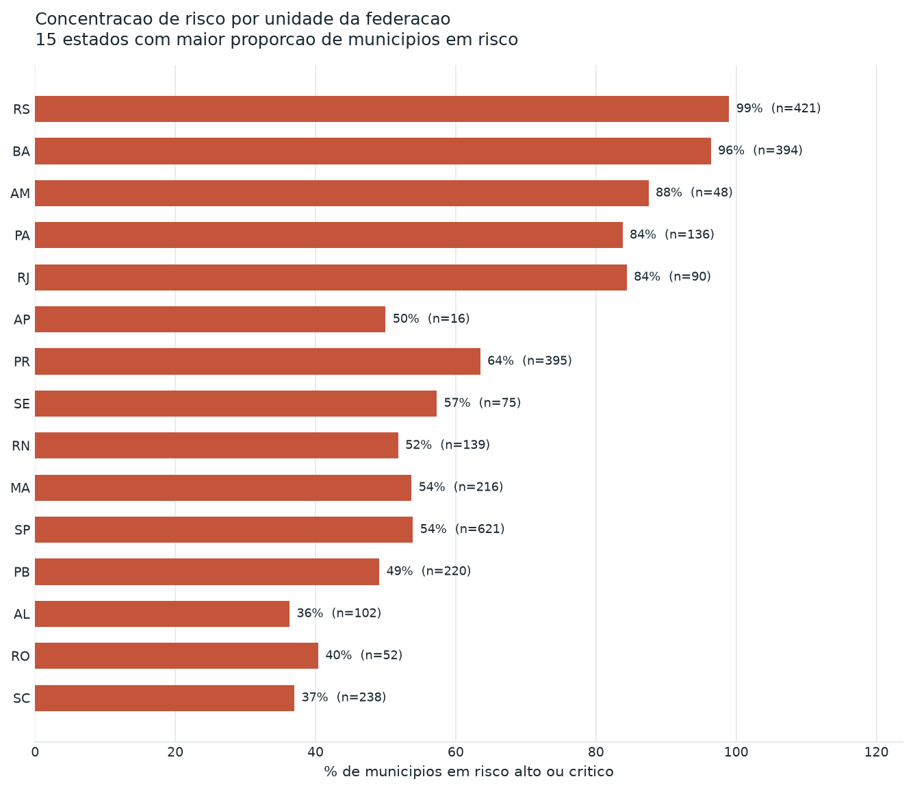

| UF | Risco médio | % em risco alto/crítico | % que de fato atingiu |
|---|---|---|---|
| Rio Grande do Sul | 0,895 | 99,0% | 9,5% |
| Bahia | 0,809 | 96,4% | 19,0% |

No Rio Grande do Sul, **apenas 9,5% dos municípios atingiram a meta de 2024**. O modelo não inventou essa concentração: ela existe no dado. O que a existência dela sugere é que os determinantes relevantes operam em escala **estadual** — rede de formação continuada, material didático adotado, programa estadual de alfabetização, política de acompanhamento —, acima da capacidade de decisão de um município isolado.

### 8.3 Distribuição do risco

| Faixa | Municípios | % |
|---|---|---|
| Baixo | 1.964 | 37,5% |
| Moderado | 969 | 18,5% |
| Alto | 1.016 | 19,4% |
| Crítico | 1.283 | 24,5% |

**2.299 municípios (43,9%) em risco alto ou crítico** — dimensão que exige priorização, não atendimento universal.

### 8.4 Perfis municipais (aprendizado não supervisionado)

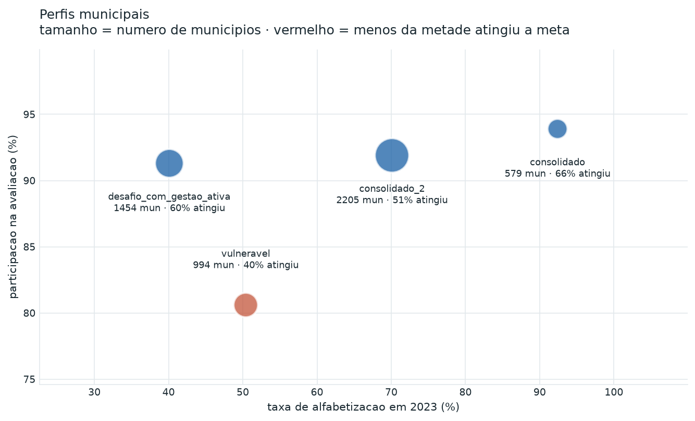

Os quatro perfis foram obtidos por **KMeans**, com o número de grupos escolhido pelo **coeficiente de silhueta**. Diferentemente do modelo preditivo, o KMeans não conhece o alvo: ele agrupa municípios apenas por semelhança de características. O fato de os grupos resultantes apresentarem taxas de sucesso tão distintas (40,2% a 65,5%) mostra que os agrupamentos capturam algo real, e não uma partição arbitrária.

O valor prático é a **diferenciação da intervenção**: o perfil `desafio_com_gestao_ativa` precisa de apoio pedagógico (a gestão já funciona), enquanto o perfil `vulneravel` precisa primeiro de apoio à gestão. Enviar o mesmo pacote para os dois desperdiça recurso nos dois.

---

## 9. Limitações do projeto

Esta seção é deliberadamente extensa. Um modelo destinado a orientar política pública que afeta crianças precisa declarar seus limites com a mesma clareza com que declara seus acertos.

### 9.1 Ancoragem estadual e risco de profecia autorrealizável

**Esta é a limitação mais séria do trabalho.**

`sigla_uf` é a variável mais importante do modelo, e a análise exploratória quantifica o peso disso: **usada sozinha, a UF já alcança AUC de 0,729**, contra 0,780 do modelo completo. A maior parte do poder preditivo é geográfica.

Isso produz distorções verificáveis no ranking de risco:

- **Dom Macedo Costa (BA)** tem taxa de 85,87% em 2023 e esforço exigido de **−5,87** — ou seja, bastaria **não piorar** para atingir a meta. O modelo atribui risco **0,98**.
- **Gramado** e **Caxias do Sul (RS)**, municípios com alto IDH e estrutura educacional consolidada, aparecem entre os dez de maior risco.

O modelo está, nesses casos, dizendo essencialmente *"este município vai falhar porque fica no Rio Grande do Sul"*.

**Por que isso é grave.** Se o score fosse usado para decidir onde **não** investir, ou para responsabilizar gestores, ele criaria um ciclo de reforço: municípios de UFs historicamente mal avaliadas receberiam menos apoio, teriam desempenho pior, e confirmariam a previsão. O modelo passaria de instrumento de diagnóstico a **causa** do problema que descreve.

**Enquadramento obrigatório de uso:**

> **O score indica onde investigar, não onde punir.**
>
> É um instrumento de **triagem** — uma lista de prioridade para visita técnica, diagnóstico local e diálogo com a rede. Não é, e não deve ser tratado como, uma avaliação de mérito de gestão municipal, nem base para condicionar repasse de recursos.

Qualquer uso operacional exige análise complementar por município, com dados locais que o modelo não possui.

**A ancoragem não é efeito de variável econômica omitida — isso foi testado.** A explicação mais natural para o peso da UF seria que "estado" estivesse medindo "riqueza": os estados que vão bem seriam simplesmente os mais ricos. A hipótese foi testada incluindo o PIB por habitante (IBGE, 2021) no modelo:

| Evidência | Resultado |
|---|---|
| Importância da UF antes do PIB | 0,1680 |
| Importância da UF depois do PIB | **0,1713** (não caiu) |
| Importância do PIB por habitante | **0,0024** — 10º lugar entre 11 variáveis |
| Correlação entre UFs: riqueza mediana × atingimento | **−0,011** |
| Correlação dentro de cada UF | −0,008 |
| Amplitude de riqueza entre estados | R$ 9.177 (MA) a R$ 50.940 (MT) |

A riqueza varia cinco vezes e meia entre os estados e não explica nada do desempenho. O caso mais claro é o próprio Ceará: não é um estado rico e lidera o atingimento com 91,3%, enquanto o Rio Grande do Sul, bem mais rico, fica em 9,5%.

**O que a UF captura é institucional, não econômico** — política estadual de alfabetização, formação continuada de professores, material estruturado, regime de colaboração entre estado e municípios. Essa é uma limitação mais interessante do que parecia: o modelo aponta para um fator real e transferível, mas que ele não consegue nomear, porque não existe na base uma variável que descreva a política estadual.

A consequência prática permanece: **um município não escolhe em que estado está**, então o score continua não podendo ser usado como medida de mérito da gestão municipal.

### 9.2 Teto de previsibilidade

Existe um limite estatístico ao que qualquer modelo pode alcançar com estes dados:

| Grandeza | Valor |
|---|---|
| Desvio-padrão da variação ano a ano do indicador | **16,6 pontos** |
| Esforço exigido mediano | **3,2 pontos** |

**O ruído é aproximadamente cinco vezes maior que o sinal.** O indicador oscila muito mais entre anos do que a distância que o município precisa percorrer — por mudança de coorte, de equipe docente, de gestão, ou por fatores simplesmente aleatórios.

Um dado que ilustra o teto: **17,6% dos municípios tinham esforço exigido negativo** (bastava não piorar) e, mesmo assim, **44,6% deles não atingiram a meta**.

Consequência: **AUC de 0,780 está próxima do máximo obtenível com estas variáveis.** Qualquer modelo que reportasse 95% de acurácia neste problema estaria, quase certamente, com vazamento de dados.

### 9.3 Ausência de dados de contexto socioeconômico

O modelo inclui **uma** variável socioeconômica: o PIB por habitante de 2021, a medida econômica municipal mais recente publicada pelo IBGE. Como mostra a seção 9.1, ela não explica o desempenho.

Continuam fora: escolaridade materna, taxa de pobreza, cobertura de creche, gasto por aluno e o IDHM. Para o IDHM a razão é o vintage — o Atlas Brasil ainda tem base no Censo de 2010, e usar dados de 2010 para explicar resultados de 2024 introduziria distorção maior que a omissão. As demais não estão disponíveis de forma completa e atualizada para os 5.232 municípios.

O resultado do teste com o PIB **reduz**, mas não elimina, a chance de haver efeito socioeconômico não medido: renda média e desigualdade não são a mesma coisa que PIB por habitante, que é uma medida de produção e não de bem-estar. Um município com uma grande mineradora tem PIB alto e pode ter população pobre.

### 9.4 Cobertura temporal

O modelo foi treinado em **uma única transição** (2023 → 2024). Não é possível distinguir padrão estrutural de particularidade daquele par de anos. Com três ou quatro transições seria possível validar temporalmente — treinar em 2022→2023 e testar em 2023→2024 — que é o teste mais honesto para um modelo com uso prospectivo.

### 9.5 Cobertura geográfica

**Acre e Roraima não estão representados.** Nenhum município desses estados possui rede municipal na base. Toda conclusão deste trabalho é silenciosa a respeito deles.

O **Distrito Federal** também está fora, por motivo diferente e não corrigível: Brasília não é município e o DF não tem rede municipal. Qualquer leitura nacional deste trabalho exclui, portanto, a capital federal.

### 9.6 Granularidade

O modelo opera sobre municípios, não escolas nem alunos. Um município pode atingir a meta agregada mantendo escolas com desempenho crítico. A desigualdade **intramunicipal** é invisível aqui — e é frequentemente onde o problema se concentra.

### 9.7 Multicolinearidade residual

Mesmo após a remoção de `meta_2030`, `distancia_2030` e das versões não logarítmicas de população e PIB, permanecem variáveis correlacionadas na base. Os coeficientes individuais devem ser lidos como indicativos de direção, não como estimativas causais precisas.

---

## 10. Aplicação prática para políticas públicas

### 10.1 Três produtos entregues

| Produto | Arquivo | Uso |
|---|---|---|
| **Ranking de risco** | `reports/ranking_risco_municipios.csv` | Fila de prioridade para visita técnica e diagnóstico local |
| **Perfis municipais** | `reports/perfis_municipais.csv` | Definição de **qual** tipo de apoio enviar a cada grupo |
| **Concentração por UF** | `reports/risco_por_uf.csv` | Identificação de onde a ação precisa ser estadual, não municipal |

### 10.2 Como cada achado vira decisão

**Participação como indicador de alerta precoce.** A participação na avaliação é conhecida **durante** o ciclo, antes do resultado. Uma rede cuja participação cai abaixo de 85% pode ser sinalizada no mesmo ano letivo — bem antes da publicação do indicador. É o único indicador antecedente identificado neste trabalho que é ao mesmo tempo observável cedo e associado ao desfecho.

**Intervenção diferenciada por perfil.**

- `desafio_com_gestao_ativa` (1.454 municípios) → **apoio pedagógico**: formação de professores, material estruturado, acompanhamento de método. A gestão já funciona; falta o conteúdo certo.
- `vulneravel` (994 municípios) → **apoio à gestão antes do pedagógico**: regularização de cadastro, rotina de acompanhamento de frequência, comunicação com famílias. Enviar apenas material didático aqui tende a não produzir efeito.
- `consolidado` (579 municípios) → **documentar e disseminar** o que funciona.

**Ação em escala estadual.** Com 99,0% dos municípios gaúchos em risco alto ou crítico, negociar município a município no RS é ineficiente. O achado indica interlocução com a Secretaria Estadual e o regime de colaboração.

**Priorização orçamentária.** Atender 2.299 municípios simultaneamente não é viável. O ranking permite construir lotes — por exemplo, os 300 de maior risco no perfil `vulneravel` — dimensionados ao orçamento disponível.

### 10.3 Salvaguardas de uso

1. O score **não** deve condicionar repasse de recursos.
2. O score **não** deve ser usado para avaliar gestores municipais.
3. Todo município sinalizado exige **verificação local** antes de qualquer conclusão — o caso de Dom Macedo Costa demonstra por quê.
4. O ranking deve ser **republicado a cada ciclo**, nunca tratado como diagnóstico permanente.

---

## 11. Possíveis evoluções futuras

### 11.1 Dados

- **Série histórica ampliada.** Com 2021→2022 e 2022→2023 seria possível fazer validação temporal e separar padrão estrutural de particularidade anual.
- **Contexto socioeconômico além do PIB.** Incorporar dados do Censo 2022 conforme forem liberados por município — renda domiciliar, escolaridade materna, desigualdade. O teste com o PIB por habitante (seção 9.1) mostrou que produção econômica não explica o desempenho, mas medidas de bem-estar e escolaridade familiar podem ter comportamento diferente.
- **Variáveis de política estadual.** Como o efeito da UF é institucional, o caminho mais promissor é descrever a política: existência de programa estadual de alfabetização, adesão ao regime de colaboração, material estruturado adotado, política de formação continuada. Isso transformaria "efeito Ceará" em variáveis acionáveis por qualquer estado.
- **Granularidade escolar.** Se microdados por escola forem disponibilizados, o modelo capturaria desigualdade intramunicipal.
- **Variáveis de gestão.** Existência de plano municipal de alfabetização, adesão a programas federais, rotatividade de secretários — mais acionáveis que geografia.

### 11.2 Modelagem

- **Modelos hierárquicos** (efeito aleatório por UF) para separar formalmente o que é estado do que é município, atacando diretamente a limitação 9.1.
- **Calibração de probabilidades** (`CalibratedClassifierCV`) para que o score possa ser lido como probabilidade real, e não apenas como ordenação.
- **Quantificação de incerteza** — intervalo de confiança por município, especialmente relevante dado o teto de previsibilidade da seção 9.2.
- **Modelo de regressão** prevendo a taxa de 2024 em valor contínuo, complementar à classificação.

### 11.3 Engenharia

- **Retreinamento automatizado** a cada publicação do INEP, com versionamento de modelo.
- **Monitoramento de *drift*** — alerta quando a distribuição das variáveis se afastar da vista em treino.
- **Interface de consulta** para o gestor consultar o próprio município e ver a decomposição SHAP da previsão.
- **Integração com o pipeline da Fase 2**, com a base analítica passando a ser uma tabela da camada Gold.

---

## Estrutura do repositório

```
tech-challenge-fase3/
├── data/
│   ├── raw/                     # fontes externas como vieram (versionadas)
│   └── processed/               # bases derivadas (não versionadas)
├── notebooks/
│   └── 01_analise_exploratoria.ipynb
├── src/
│   ├── preprocessing/
│   │   ├── construir_base_analitica.py
│   │   ├── baixar_dados_ibge.py
│   │   └── enriquecer_base.py
│   ├── visualization/
│   │   └── analise_exploratoria.py
│   ├── modeling/
│   │   └── treinar_modelo.py
│   └── evaluation/
│       ├── interpretar_modelo.py
│       └── aplicacao_estrategica.py
├── reports/                     # resultados em CSV e JSON
├── images/                      # gráficos gerados
├── requirements.txt
├── .gitignore
└── README.md
```

## Como reproduzir

```bash
python -m venv .venv
.venv\Scripts\activate            # Windows
pip install -r requirements.txt

python src/preprocessing/construir_base_analitica.py
python src/preprocessing/baixar_dados_ibge.py --ano 2021 --ano-pib 2021
python src/preprocessing/enriquecer_base.py
python src/visualization/analise_exploratoria.py
python src/modeling/treinar_modelo.py
python src/evaluation/interpretar_modelo.py
python src/evaluation/aplicacao_estrategica.py
```

## Fontes de dados

- INEP — Indicador Criança Alfabetizada e metas municipais (via camada Gold da Fase 2)
- IBGE — API de Localidades: `servicodados.ibge.gov.br/api/v1/localidades/municipios`
- IBGE — SIDRA, agregado 6579: estimativa populacional municipal
- IBGE — SIDRA, agregado 5938: PIB dos Municípios (2021)
